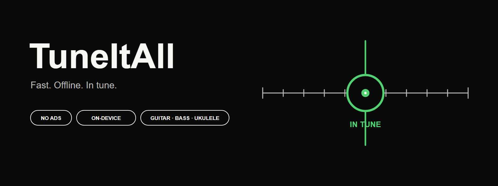
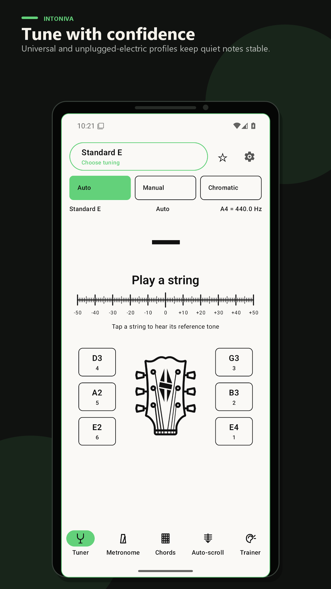
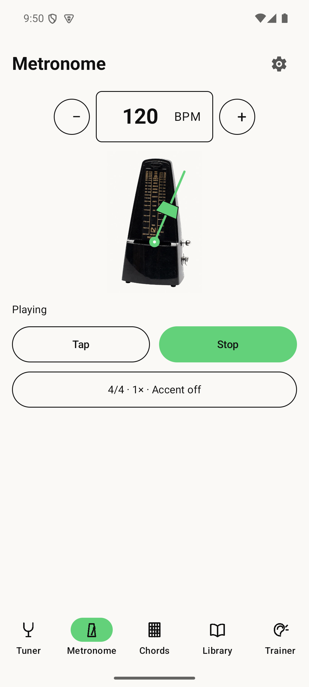
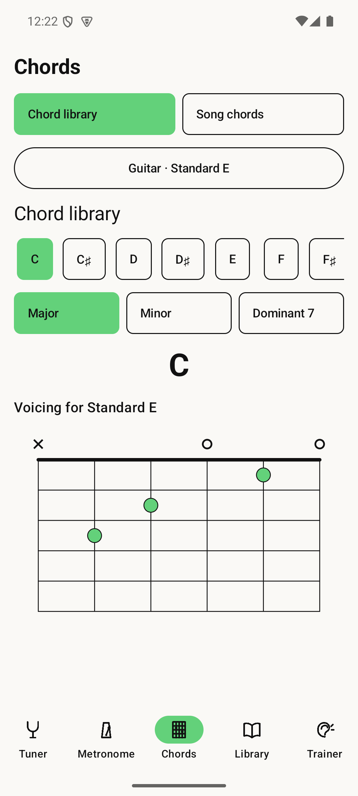
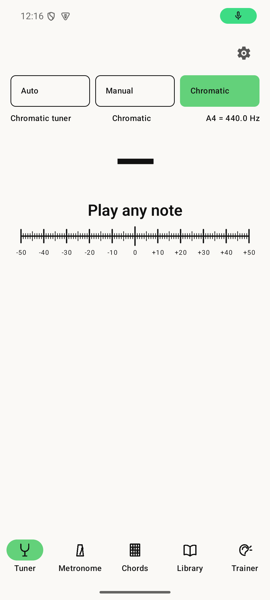
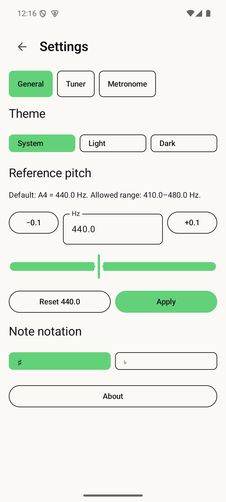
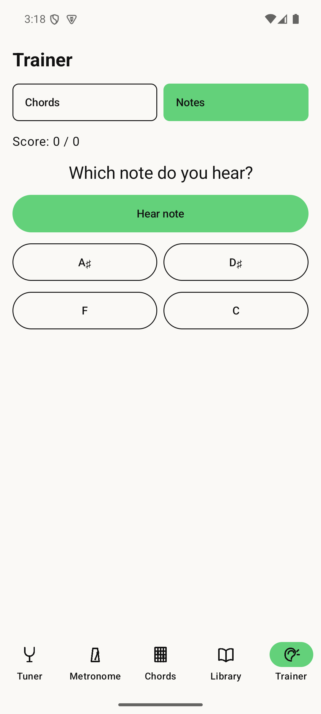

# TuneItAll

[](https://github.com/Majkey25/TuneItAll/actions/workflows/android.yml)
[](https://github.com/Majkey25/TuneItAll/releases)
[](https://github.com/Majkey25/TuneItAll/releases)
[](https://github.com/Majkey25/TuneItAll/releases)
[](https://kotlinlang.org/)
[](LICENSE)

TuneItAll is a fast, offline Android tuner for guitar, bass, ukulele, and
chromatic use. It opens directly on the tuner surface. No account, ads,
analytics, tracking, onboarding, or network permission.

Status: public testing prerelease `0.3.0-alpha.7`. TuneItAll is not published
on Google Play.

## Download

[](https://github.com/Majkey25/TuneItAll/releases/download/v0.3.0-alpha.7/TuneItAll-v0.3.0-alpha.7-debug.apk)

The current APK supports Android 8.0 and newer. It is a debug-signed testing
build distributed through GitHub, so Android may ask for permission to install
an app from this source. The APK and its SHA-256 checksum are also available on
the [release page](https://github.com/Majkey25/TuneItAll/releases/tag/v0.3.0-alpha.7).

## Features

- Auto, Manual, and Chromatic modes.
- A clean-room, pYIN-derived streaming tracker with multi-candidate YIN frames,
  an adaptive noise floor, and bounded online temporal tracking.
- Live frequency, signed cents, flat/sharp direction, and a −50…+50 cent rail.
- A foreground-only mechanical metronome from 20 to 400 BPM with meter,
  subdivision, accent, sound, volume, mute, and count-in controls.
- Canonical major, minor, and dominant-seventh chord diagrams from a pinned
  offline catalog for Standard E guitar and Standard C ukulele. Other tunings
  never receive a guessed fingering.
- Local audio-file chord analysis with synchronized playback, a smoothed chord
  timeline, tuning selection, and ±12-semitone transposition. The detector is
  experimental and can mislabel dense mixes, inversions, or extended chords.
- Chord learning, hidden-answer chord quiz, and 12-note ear training with
  generated audio and local scoring.
- Guitar: 6, 7, 8, and 9 strings with inline and split headstocks.
- Four-string bass and ukulele.
- 38 built-in tunings, including lowered standard, Drop D through Drop F,
  DADGAD, open tunings, extended-range guitar, bass, and ukulele presets.
- Searchable library, favorites, last-used state, and up to 100 custom tunings.
- Adjustable A4 reference from 410.0 to 480.0 Hz in 0.1 Hz steps; 440.0 Hz is
  the safe default.
- Adjustable microphone sensitivity from 0 to 100; 100 is the quiet-instrument
  default, with balanced, quiet-room, noisy-room, and fast-response profiles.
- Tap any string to switch to Manual mode and hear its generated reference tone.
- One confirmation chime after the note stays in tune for 250 ms. It respects
  Silent/DND, is excluded from pitch detection, and never creates a notification
  or popup.
- Sharps or flats notation and generated reference audio with no bundled samples.
- System-default, English, Czech, German, French, and Spanish interfaces. The
  complete translations ship offline on Android 8.0 and newer.
- Attributed 3+3 and 6-inline guitar headstock artwork with functional string
  controls and typed note order. Extended instruments retain their
  data-driven layouts.
- A simple Light/Dark Compose interface, one global Settings destination, an
  exact CC0-based animated metronome, and a quick rhythm panel.
- An optional ScanIt-style Buy Me a Coffee button in App details. It opens an
  external browser and does not unlock features or change support priority.

## Screenshots

| Preset tuner | Mechanical metronome | Chord library |
| --- | --- | --- |
|  |  |  |

| Chromatic tuner | Global settings | Ear trainer |
| --- | --- | --- |
|  |  |  |

## Architecture

One native Kotlin application module:

- `AudioRecord` mono PCM16 input with unprocessed/voice-recognition selection.
- A clean-room, pYIN-derived streaming path: multi-candidate YIN analysis,
  adaptive noise rejection, and a bounded online pitch tracker.
- Equal-temperament note math, target hysteresis, and needle-only visual
  smoothing.
- One continuous mono PCM16 `AudioTrack` for foreground-only metronome playback.
- Native `MediaExtractor`/`MediaCodec` decoding for user-selected local audio,
  followed by bounded STFT chroma extraction, template matching, and temporal
  smoothing. No audio file is copied, uploaded, or retained by TuneItAll.
- Harmonic-rich one-shot reference tones with click-free switching.
- Pinned MIT `chords-db` data for canonical guitar and ukulele fingerings.
- Theme-aware attributed headstock images and a native metronome body.
- Notification-sonification confirmation audio with a bounded microphone input gate.
- Jetpack Compose UI with one immutable tuner state.
- Bounded `SharedPreferences` storage and one validated JSON custom-tuning array.

The manifest requests only `android.permission.RECORD_AUDIO`. Microphone samples
are processed transiently in memory on-device and are never recorded, retained,
shared, or transmitted. Song files are opened through Android's system document
picker, which grants access only to the file selected by the user.

On the dedicated API 35 acceptance emulator, 500 pre-generated tuner frames had
an 8.67 ms p95 processing time against the 42.7 ms hop budget, with no backlog.
The real metronome player ran at 137 BPM for five minutes with zero reported
`AudioTrack` underruns. A separate 400 BPM run kept one output session with zero
underruns before and after a confirmed 400 → 137 BPM edit. A generated four-second
C-major WAV completed picker, decoding, recognition, timeline, playback, and
position-sync checks on the API 35 emulator. The target Samsung `SM-S938B` was not
available for this acceptance run, so quiet/room-noise behavior and acoustic
sound quality still require physical-device listening before a broader release.

## Build

Requirements:

- JDK 17
- Android SDK 36
- A connected Android 8.0+ device or emulator for live QA

Windows PowerShell:

```powershell
$env:JAVA_HOME = 'C:\Program Files\Eclipse Adoptium\jdk-17.0.20.8-hotspot'
.\tools\build.ps1 -AllowUnsigned
```

Debug APK:

`app/build/outputs/apk/debug/app-debug.apk`

Wireless ADB install:

```powershell
adb devices -l
adb -s '<wireless-device-serial>' install -r app\build\outputs\apk\debug\app-debug.apk
adb -s '<wireless-device-serial>' shell am start -n com.tuneitall.tuner/.MainActivity
```

Release bundle generation:

```powershell
.\gradlew.bat :app:bundleRelease --no-daemon
```

The generated bundle is unsigned for production until a private Play App
Signing/upload-key configuration is supplied outside the repository.

## CI and releases

GitHub Actions runs unit tests, Android Lint, debug assembly, release bundle
assembly, package/permission verification, and SHA-256 generation. Actions are
pinned to immutable commit SHAs.

Pre-release tags such as `v0.3.0-alpha.7` build a verified, debug-signed APK and
publish it with a SHA-256 checksum. A reviewed stable `vX.Y.Z` tag triggers the
signed release workflow only when all four keystore secrets are configured. It
creates a draft GitHub release; Play upload remains a deliberate manual step.
See [release process](docs/releasing.md), [architecture](docs/architecture.md),
and [security policy](SECURITY.md).

## Store assets and release documents

- Feature graphic: `fastlane/metadata/android/en-US/images/featureGraphic.png`
- Play icon: `fastlane/metadata/android/en-US/images/icon.png`
- Regenerate the Play icon with `java tools/RenderStoreIcon.java` from the
  repository root.
- English/Czech listings: `docs/store/`
- Privacy policies: `docs/privacy/`
- Public website: `https://majkey25.github.io/TuneItAll/`
- Public privacy policy: `https://majkey25.github.io/TuneItAll/privacy/`
- Data Safety record and release checklist: `docs/store/`
- Deterministic SVG sources: `assets/source/`

## Licence

Copyright © 2026 TuneItAll. All rights reserved. This repository is proprietary;
see [LICENSE](LICENSE). Third-party components retain their own licences; see
[THIRD_PARTY_NOTICES.md](THIRD_PARTY_NOTICES.md).
