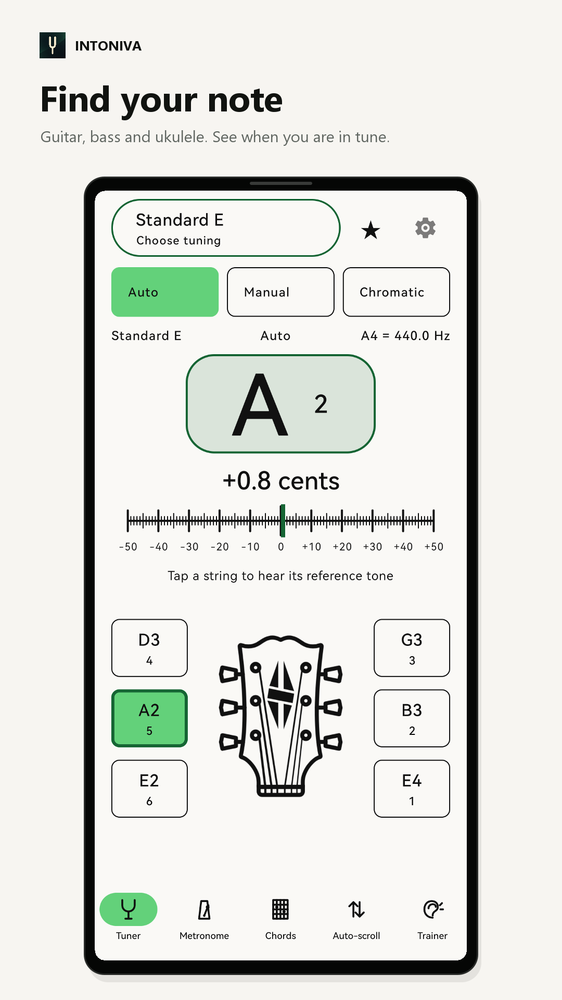
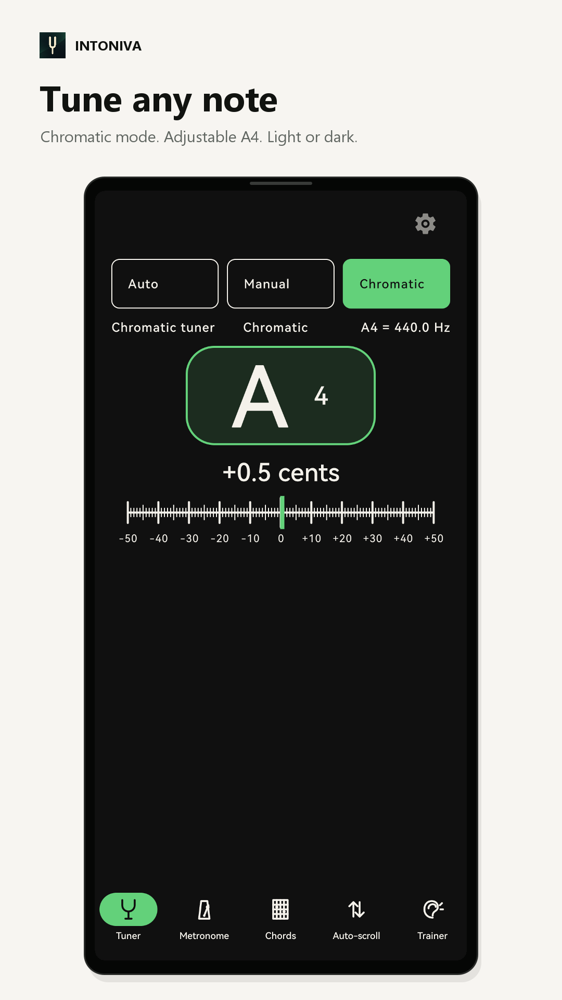
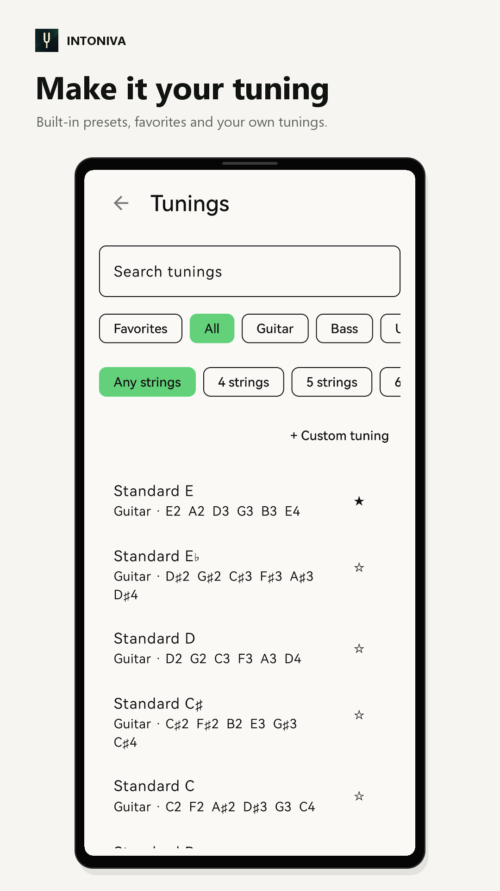
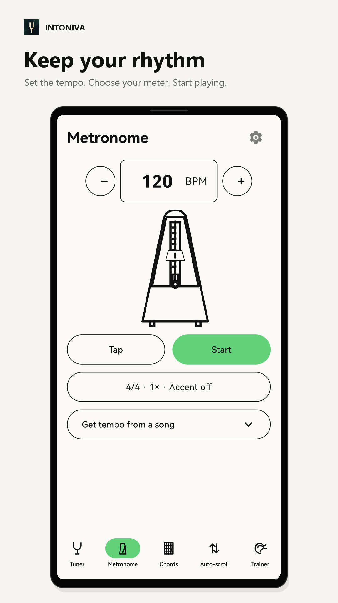
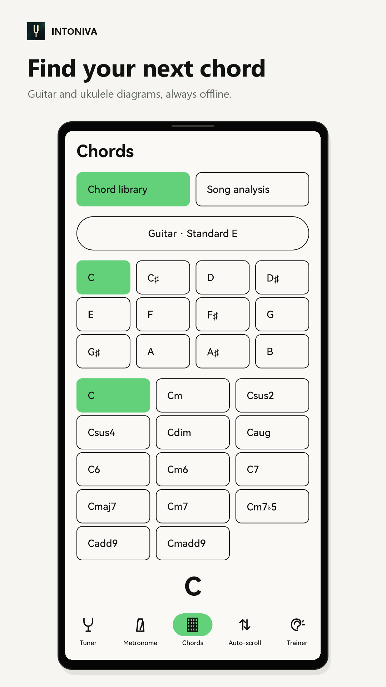
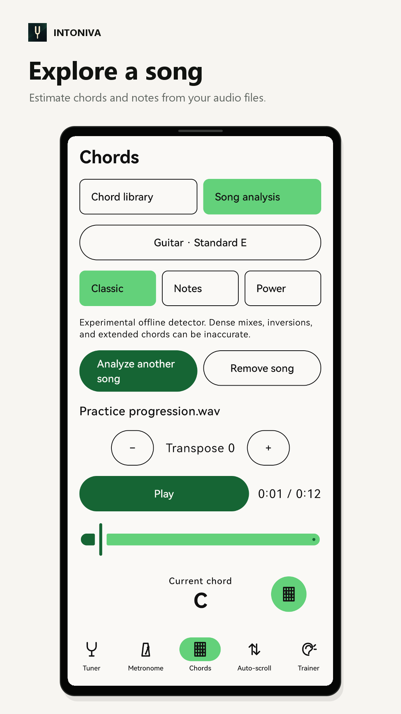
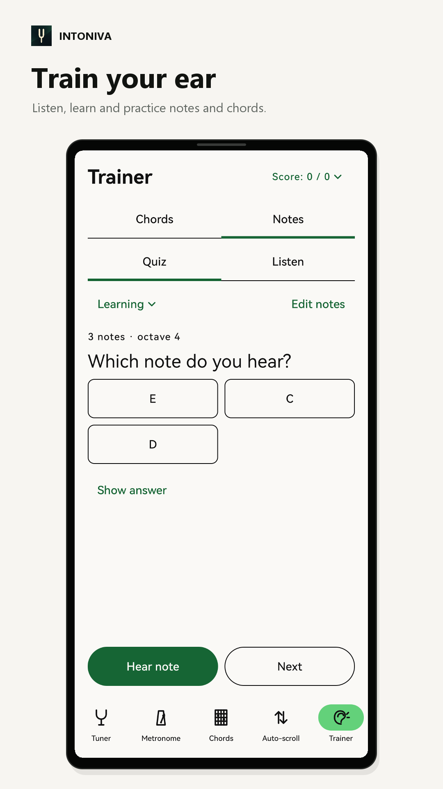
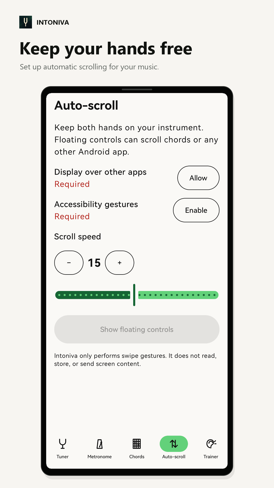

# Intoniva

[](https://github.com/Majkey25/TuneItAll/actions/workflows/android.yml)
[](https://github.com/Majkey25/TuneItAll/releases)
[](https://github.com/Majkey25/TuneItAll/releases)
[](https://github.com/Majkey25/TuneItAll/releases)
[](https://kotlinlang.org/)
[](LICENSE)

Intoniva is a fast, offline Android tuner for guitar, bass, ukulele, and
chromatic use. It opens directly on the tuner surface. No account, ads,
analytics, tracking, onboarding, or network permission.

Intoniva is free on [Google Play](https://play.google.com/store/apps/details?id=com.tuneitall.tuner).
All features are free. There are no subscriptions or paid feature unlocks.
Latest GitHub version: `0.3.0-alpha.35`. The Play version can lag behind while
Google reviews an update. See the dated [release record](docs/store/2026-09-27-alpha32-release.md).

## Download

[Google Play: free download](https://play.google.com/store/apps/details?id=com.tuneitall.tuner)

[](https://github.com/Majkey25/TuneItAll/releases/download/v0.3.0-alpha.35/Intoniva-v0.3.0-alpha.35-debug.apk)

The current APK supports Android 8.0 and newer. It is a debug-signed testing
build distributed through GitHub, so Android may ask for permission to install
an app from this source. The APK and its SHA-256 checksum are also available on
the [release page](https://github.com/Majkey25/TuneItAll/releases/tag/v0.3.0-alpha.35).

## Features

### Tuner

- Opens directly to tuning, without an account, onboarding flow or ads.
- **Auto** selects a target string from your tuning. **Manual** lets you choose
  the string. **Chromatic** identifies notes without a guitar-headstock layout.
- Displays the note and octave, frequency in Hz, signed cents and flat/sharp
  direction on a moving −50 to +50 cent scale.
- Keeps the display awake while listening, including pauses between notes.
  Leaving the tuner releases the screen-on request.
- Tap a string to select it and hear its generated reference tone.
- Green feedback and a confirmation chime after a stable in-tune reading.
  Silent/DND is respected. Feedback rejection limits the chime feeding back
  into detection; wider ranges and Chromatic mode briefly gate microphone input.
- Choose sharps or flats and split or inline headstocks where supported.
  Six-string guitar offers 3+3 and 6-inline layouts, with numbered strings.
- Set the A4 reference from **410.0 to 480.0 Hz** in 0.1 Hz steps, including
  444 Hz. Reset to the standard 440 Hz. Out-of-range values are rejected and
  unusually low or high references require confirmation.

### Instruments and tuning library

Open the tuning selector at the top of the tuner to search presets, use
favorites, or create custom tunings. Intoniva remembers the last selection
and supports up to 100 saved custom tunings.

| Instrument | Included presets |
| --- | --- |
| 6-string guitar | Standard E and lowered standards through A; Drop D through F; DADGAD; Open D, E, G and A |
| 7-string guitar | Standard B; Drop A, G and F |
| 8-string guitar | Standard F♯ and Drop E |
| 9-string guitar | Standard C♯ and Drop B |
| 4-string bass | Standard E, E♭, D and C; Drop D; BEAD |
| 5-string bass | Standard B and B♭; Drop A; high C |
| 6-string bass | Standard B |
| Ukulele | Standard C with high G, low G and baritone |
| Violin, viola, cello and mandolin | Standard tuning presets |

Chromatic mode is also available for other instruments. A preset defines target
notes; it does not guarantee a phone microphone can capture every instrument
or room equally well.

### Tuner controls

- Universal default plus Unplugged electric, Quiet room, Noisy room and
  Fast response profiles.
- Microphone sensitivity from 0 to 100, separate from visual needle stability.
- Fast, Balanced or Stable response.
- Advanced noise rejection, harmonic protection, in-tune tolerance,
  confirmation time and reading hold.
- Automatic, raw/unprocessed or compatible microphone input. Raw input is
  selectable only when supported; the active input is shown.
- Reset to the Universal audio defaults.

### Metronome

- **20 to 400 BPM**, direct numeric entry, increment/decrement controls and tap tempo.
- Animated mechanical pendulum driven by playback timing.
- Time signatures with 1–12 beats and denominators 2, 4, 8 or 16.
- One to four subdivisions per beat, accents off or every 2–12 beats,
  and optional count-in of 1, 2 or 4 bars.
- Five generated sounds: Deep, Wood, Click, Rim and Bright.
- Volume, mute, start/stop and a quick rhythm-settings panel.
- Foreground-only playback. Leaving the app stops the metronome.

### Get tempo from a song

Expand this section in the metronome, choose a local audio file and analyze
its rhythm on the device. View the estimated BPM and rhythm-match score,
then apply the tempo to the metronome with one tap. Collapsing the section
keeps the result and leaves the main metronome controls uncluttered.

The score measures repetition, not the probability that the musical tempo is
correct. Half/double-time readings can occur, especially with ambiguous rhythms.

### Chord library

- Browse all 12 roots with major, minor, sus2, sus4, diminished, augmented,
  major/minor sixth, dominant/major/minor seventh, half-diminished seventh,
  add9 and minor add9 chord types.
- View verified finger positions, open/muted strings, barres and fret positions
  from the bundled `chords-db` catalog.
- Diagram support is for **Standard E guitar and Standard C ukulele**.
  If the selected tuning or chord has no verified shape, Intoniva does not
  invent a fingering.

### Song chords, melody notes and acoustic shapes

Use **Chords → Song analysis** to select a local audio file. Supported formats
depend on the Android device's decoder; files can be up to 30 minutes long.

- **Classic:** estimate chord names, including supported extended chord types.
- **Notes:** follow the strongest stable melody note, with Any melody, Guitar,
  Bass, Violin and Piano ranges. This is not a full polyphonic score.
- **Power:** estimate root-and-fifth power chords without forcing major/minor thirds.
- Play/pause the source file, seek through the timeline, or tap an event to jump
  to it. A fixed bottom panel keeps the current chord or note visible.
- Show or hide chord diagrams in the current-event panel.
- Transpose displayed chords/notes by up to 12 semitones in either direction.
  This does not pitch-shift the recording.
- **Exact** and **Easy acoustic** arrangements suggest Standard E guitar shapes
  and a capo position from 0 to 8. Easy acoustic simplifies some extended chords;
  Exact refers to the arrangement, not guaranteed recognition accuracy.
- Replace or remove the selected song. Analysis runs locally without uploading
  the recording or building a cloud library.

Song recognition is experimental. Dense rock/metal mixes, distortion, inversions,
overlapping instruments and extended harmonies can produce wrong or missing
labels. Use the result as a practice aid and check it by ear, not as a guaranteed
transcription of any song. YouTube-link import and instrument-stem separation
are not included.

### Trainer

- **Learn chords:** choose supported guitar/ukulele tuning, pick roots and
  qualities from a grid, view diagrams, and listen to the chord. The first
  chord and Next are random, not a fixed chromatic sequence.
- **Chord quiz:** hear a random chord, answer, and optionally reveal its diagram.
  Consecutive questions do not repeat the same chord.
- **Note banks:** keep separate Learning and Learned sets. Start with C, D and E,
  select any of the 12 pitch classes, or move notes to the Learned bank.
  Both sets stay on the device across restarts.
- **Listen and compare:** tap notes to hear them, select A/B notes in octave 4,
  replay either one, or repeat the pair with a short silent gap.
  Repeating stops when leaving the trainer or putting the app in the background.
- **Note quiz:** questions and answer choices use only the selected bank.
  At least two notes are needed. Compare the answer with your guess after answering.
- Trainer opens in Quiz. Next skips and immediately plays the next question;
  Show answer reveals it without scoring an attempt.
- Playback and Next controls stay visible below the scrollable content.
  Answering does not expand the note quiz footer; A/B comparison opens on request.
  Track correct answers and attempts locally, or reset the score without clearing
  the note banks.

### Hands-free auto-scroll

- Scroll chord sheets in Intoniva or content in other Android apps.
- Floating Start/Stop and speed controls, a draggable overlay, and a compact
  hidden-control bubble that can be reopened.
- Requires user-enabled overlay and Accessibility permissions. No Shizuku or root.
- The Accessibility service sends swipe gestures only. It cannot retrieve
  window contents and does not read, store or transmit screen text.
- Stop or close the overlay when finished.

### Appearance, language, privacy and support

- System, Light and Dark themes with green accents.
- System-default language or English, Czech, German, French and Spanish.
- One Settings destination, with General, Tuner and Metronome sections.
- About Intoniva includes the version, attribution, licence information,
  privacy notice, legal-policy links and publisher contact.
- **Support me** at the bottom of General settings, with the same yellow
  Buy Me a Coffee button also available in About Intoniva.
- Support is optional. It opens an external browser, unlocks no features
  and does not change support priority. External websites have their own
  privacy practices; in-app payment information is not collected by Intoniva.
- Musical tools run offline. The app has no Internet or advertising-ID
  permission, ads, accounts, analytics or tracking SDKs.

## Screenshots

| Preset tuner | Chromatic mode |
| --- | --- |
|  |  |

| Tuning library | Mechanical metronome |
| --- | --- |
|  |  |

| Chord library | Song chords |
| --- | --- |
|  |  |

| Ear trainer | Auto-scroll anywhere |
| --- | --- |
|  |  |

## Architecture

One native Kotlin application module:

- `AudioRecord` mono PCM16 input that prefers unprocessed capture, then clean
  voice recognition, with the processed microphone as the last fallback.
- A clean-room, pYIN-derived streaming path: multi-candidate YIN analysis,
  adaptive noise rejection, and a bounded online pitch tracker.
- Equal-temperament note math, target hysteresis, and needle-only visual
  smoothing.
- One continuous mono PCM16 `AudioTrack` for foreground-only metronome playback.
- Native `MediaExtractor`/`MediaCodec` decoding for user-selected local audio,
  preserving channel powers before bounded STFT chroma extraction, template matching, and temporal
  smoothing. No audio file is copied, uploaded, or retained by Intoniva.
- Harmonic-rich one-shot reference tones with click-free switching.
- Pinned MIT `chords-db` data for canonical guitar and ukulele fingerings.
- Theme-aware attributed headstock images and a native metronome body.
- Notification-sonification confirmation audio with a bounded microphone input gate.
- Jetpack Compose UI with one immutable tuner state.
- Bounded `SharedPreferences` storage and one validated JSON custom-tuning array.
- A user-started `specialUse` foreground overlay and gesture-only
  Accessibility service for Auto-scroll. Accessibility window-content
  retrieval is explicitly disabled.

The manifest requests `RECORD_AUDIO` plus the Android overlay and foreground
service permissions required by optional Auto-scroll. It requests no `INTERNET`
or `AD_ID` permission. Microphone samples are processed transiently in memory
on-device and are never recorded, retained, shared, or transmitted. Song files
are opened through Android's system document picker, which grants access only
to the file selected by the user. Auto-scroll performs swipe gestures only and
does not read, store, or transmit screen content.

On the dedicated API 35 acceptance emulator, 500 pre-generated tuner frames had
an 8.67 ms p95 processing time against the 42.7 ms hop budget, with no backlog.
The real metronome player ran at 137 BPM for five minutes with zero reported
`AudioTrack` underruns. A separate 400 BPM run kept one output session with zero
underruns before and after a confirmed 400 → 137 BPM edit. A generated four-second
C-major WAV completed picker, decoding, recognition, timeline, playback, and
position-sync checks on the API 35 emulator. Huawei `YAL-L21` physical QA
confirmed 48 kHz mono Voice Recognition capture without Huawei preprocessing,
AGC, NS, or AEC. Acoustic quality still requires the instrument itself;
emulator audio is not treated as microphone evidence.

## Build

Requirements:

- JDK 17
- Android SDK 36
- A connected Android 8.0+ device or emulator for live QA

Windows PowerShell:

```powershell
$env:JAVA_HOME = 'C:\Program Files\Eclipse Adoptium\jdk-17.0.20.8-hotspot'
.\tools\build.ps1 -AllowUnsigned
```

Debug APK:

`app/build/outputs/apk/debug/app-debug.apk`

Wireless ADB install:

```powershell
adb devices -l
adb -s '<wireless-device-serial>' install -r app\build\outputs\apk\debug\app-debug.apk
adb -s '<wireless-device-serial>' shell am start -n com.tuneitall.tuner/.MainActivity
```

Release bundle generation:

```powershell
.\gradlew.bat :app:bundleRelease --no-daemon
```

The generated bundle is unsigned for production until a private Play App
Signing/upload-key configuration is supplied outside the repository.

## CI and releases

GitHub Actions runs unit tests, Android Lint, debug assembly, release bundle
assembly, package/permission verification, and SHA-256 generation. Actions are
pinned to immutable commit SHAs.

Pre-release tags such as `v0.3.0-alpha.18` build a verified, debug-signed APK and
publish it with a SHA-256 checksum. A reviewed stable `vX.Y.Z` tag triggers the
signed release workflow only when all four keystore secrets are configured. It
creates a draft GitHub release; Play upload remains a deliberate manual step.
See [release process](docs/releasing.md), [architecture](docs/architecture.md),
and [security policy](SECURITY.md).

Latest audio checks: [song tempo and screen-on evidence](docs/tempo-awake-2026-09-24.md),
[song chord and note evidence](docs/song-evidence-2026-09-19.md),
[quiet harmonic fit](docs/quiet-harmonic-fit-2026-09-12.md),
[song-feature stability](docs/song-feature-stability-2026-09-12.md),
[confirmation feedback](docs/confirmation-feedback-2026-09-12.md),
[bounded quiet-note recovery](docs/quiet-gap-recovery-2026-09-12.md),
[quiet-retune tracking](docs/quiet-retune-evidence-2026-09-12.md),
[quiet-note decay](docs/quiet-current-evidence-2026-09-08.md), and
[stereo song analysis](docs/stereo-song-analysis-2026-09-08.md).
The [offline model evaluation](docs/audio-model-evaluation-2026-09-08.md)
records rejected alternatives and the remaining accuracy limits.

## Store assets and release documents

- Feature graphic: `fastlane/metadata/android/en-US/images/featureGraphic.png`
- Play icon: `fastlane/metadata/android/en-US/images/icon.png`
- Regenerate Android, Play, website, and GitHub branding with
  `java tools/RenderStoreIcon.java` from the repository root.
- Icon source and ImageGen prompts: [assets/source/ICON.md](assets/source/ICON.md)
- English and Czech store artwork uses 16 device captures of the production UI.
  Capture provenance and checks: [October branding update](docs/store/2026-10-03-branding.md).
  Regenerate the 1080×1920 framed artwork with `java tools/RenderStoreScreenshots.java`.
- English/Czech listings: `docs/store/`
- Privacy policies: `docs/privacy/`
- Public website: `https://majkey25.github.io/TuneItAll/`
- Public privacy policy: `https://majkey25.github.io/TuneItAll/privacy/`
- Data Safety record and release checklist: `docs/store/`
- Deterministic SVG sources: `assets/source/`

## Legal policies and contact

Published on this application's GitHub Pages:

- [All policies and publisher contact](https://majkey25.github.io/TuneItAll/legal/)
- [Privacy policy](https://majkey25.github.io/TuneItAll/privacy/)
- [Terms of use](https://majkey25.github.io/TuneItAll/terms/)
- [Refund policy](https://majkey25.github.io/TuneItAll/refunds/)
- [Cookies policy](https://majkey25.github.io/TuneItAll/cookies/)
- [Support](https://majkey25.github.io/TuneItAll/support/) · [Email MajkeyLab](mailto:majkeylab@gmail.com)

The app is free. This website has no analytics, contact forms, or optional
tracking cookies. GitHub Pages processes technical hosting data as described
in the privacy policy. GitHub issues are public; send private requests by email.

## Licence

Copyright © 2026 Intoniva. All rights reserved. This repository is proprietary;
see [LICENSE](LICENSE). Third-party components retain their own licences; see
[THIRD_PARTY_NOTICES.md](THIRD_PARTY_NOTICES.md).
